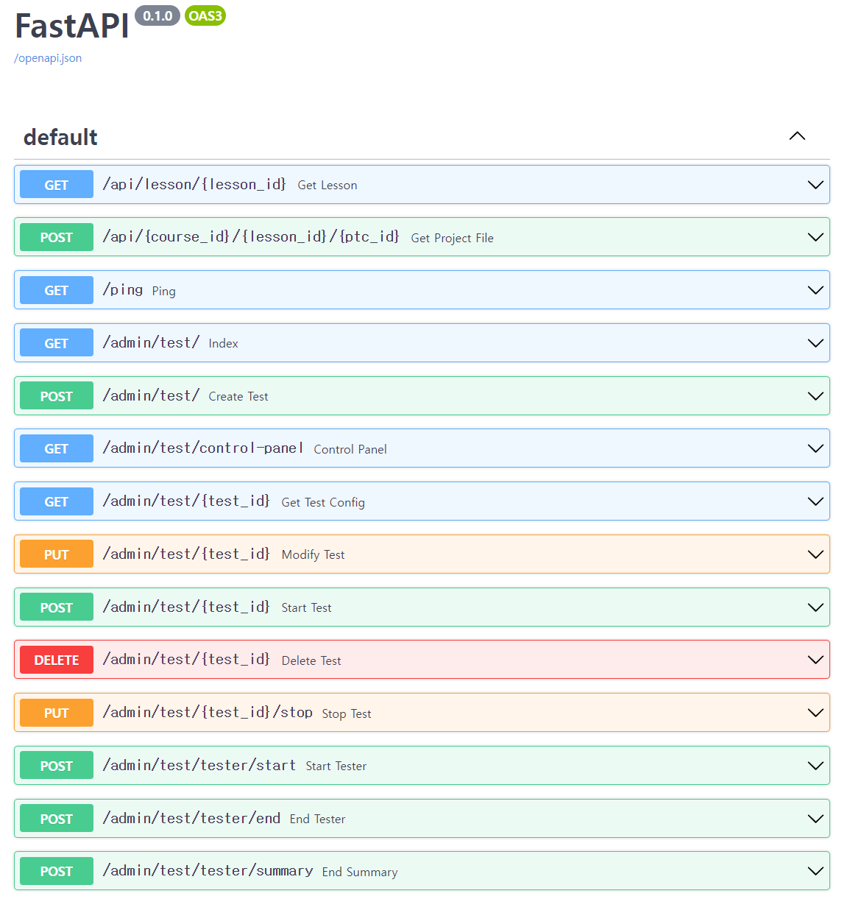

# IDE server

**IDE server** handles all real-time events occurred in [web IDE](https://github.com/Together-Coding/Client). 
When it receives data related to file modification or a cursor position moved on the editor, it broadcasts to appropriate users for them to apply the changes in their IDE immediately.  
All data related to files are stored in [Redis](https://redis.com/) to handle requests more quickly. For instance, IDE-server can download compressed template code uploaded to each lesson before, decompress it, and then upload the output to Redis in easy-to-handle data types.  
It also provides websocket handlers used to manipulate file, directory, code-based QnA, and so on.

## What it does

I had written a [Websocket API specification](https://a2tt.notion.site/IDE-server-Websocket-API-Sharing-cad240663a7943a3b4c196916733f7ab) in Korean for IDE-server and [Client](https://github.com/Together-Coding/Client).

### File management

- IDE-server uses ZSET and STRING date type of Redis to store file list and file contents respectively. It also uses HASH to store last cursor position of each file.  
- When a user accesses an IDE for the first time, the server downloads a compressed template that is uploaded by a teacher through [API-server](https://github.com/Together-Coding/API-Server), decompresses it, and makes the output files as a user's project by copying them to Redis. 
- If a project has been backup by [Project-Backup-Lambda](https://github.com/Together-Coding/Project-Backup-Lambda), it will download the backup from AWS S3, and does the same thing like processing the template files.
- It can return file list from Redis and provide functionalities to create/read/update/delete/rename files and directories.

### Features for class

Every features work on a class basis.

- IDE-server notifies users who is online/offline on their lesson.
- It lets users subscribe other users.
- It lets users change who can access their project on what permission.
- It also lets users know whose project they have access to.

### Real-time sharing

Users continuously share cursor positions and code modification data in real-time. Because saving the changed data is processed by other handlers, IDE-server just broadcasts the sharing messages to appropriate users for them to apply the changes in their IDE immediately.

### Code-based QnA

> You can think of `user_projects` as an identifier for a user's files, and `participants` as a user in a course.

As we intended to implement **code-based QnA**, which means questions are attached to a specific code line, and the line can be changed when users modify code before it, there is `code_references`, `feedbacks` and `comments` separately.  
The first one is used to make it easy to change the linked line number whenever required. The second one is to group comments by their feedback, and to let users to set who can see this QnA thread and whether it is resolved. It could be regarded as a community post that has no contents. The last one is literally to implement comments.

For code-based QnA, IDE-server provides functions that are used to list all QnA threads, create/update/delete/modify questions and comments.

### Websocket monitoring

Monitoring was implemented to do a performance analysis. By overriding emission and handler functions of [python-socketio](https://github.com/miguelgrinberg/python-socketio), IDE-server injects the timestamp when it receives and sends a message. You can see the implementation from [here](./server/websockets/__init__.py).

[highcharts](https://highcharts.com/) is used to visualize the websocket transmission between the servers and the clients.

More details can be found at [Test management](#test-management) and [Performance-Analysis](https://github.com/Together-Coding/Performance-Analysis).

### Test management

IDE-server also manages performance test. Performance analysis and enhancement are two of the evaluation criteria for the capstone project. More details can be found at [Performance-Analysis](https://github.com/Together-Coding/Performance-Analysis).

You can configure how many clients there will be, which participant the testers are going to send messages about, and what the server URL is that will handle websocket messages from all testers.  
Tester machines are launched as AWS Fargate containers, and they use the images built out of [Performance-Analysis](https://github.com/Together-Coding/Performance-Analysis).

If a new test is created, the console page looks like this. At the moment, the machines are being launched and they send a request for the information about its test. If they get the response, they are in pending state waiting for the admin to click the 'Start' button.

When the test is started, you can see what socket.io events are sent to the server and also sent from the server. The testers accumulate all delay time which is an interval from the time client sent the event to the time clients receive the responses caused by the first event.  
After remaining time becomes zero, the testers stop sending events, and send gzip-compressed logs and [K6](https://k6.io/) test summary to the server. Then, the server uploads them to AWS S3 that are going to be used by [Performance-Analysis](https://github.com/Together-Coding/Performance-Analysis) script.

## Requirements

- Python 3.10+

## Development

1. Copy and modify dotenv file.  
    `$ cp .env.example .env`
2. If you want to launch tester containers, configure AWS credentials. Check out [here](https://boto3.amazonaws.com/v1/documentation/api/latest/guide/credentials.html) to see how to do that.
3. Install packages.  
    `$ pip install -r requirements.txt`
4. Set SSH tunneling for you to be able to access AWS Elasticache.  
    > AWS Elasticache can only be accessed from the same VPC of it.  

    `$ ssh -i <ssh_pem_key> <EC2_user>@<EC2_IP_address> -f -N -L 6379:<Redis_endpoint>:6379`
5. Start server  
    `$ uvicorn app:app --port 8001 --reload`

## Deployment

As running out of time, I manually deployed with `git pull`. 😢

## API Document

API documents can be found here: http://localhost:8001/docs.

They are generated by [swagger](https://github.com/swagger-api/swagger-ui) integrated into FastAPI. 
It automatically updates documents whenever you modify your code. See more details from [here](https://fastapi.tiangolo.com/features/#automatic-docs).

